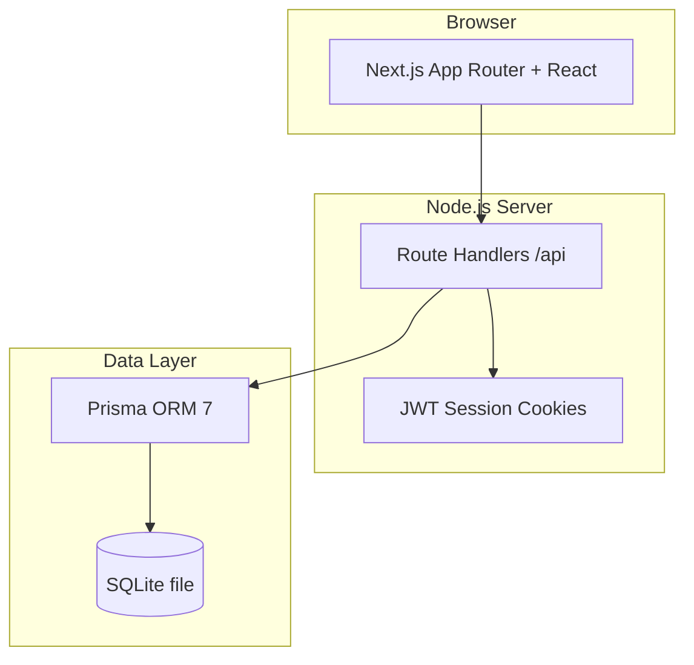

# AtomQuest Goals — In-House Goal Setting & Tracking Portal

[](https://github.com/nitish0009/goal-tracker)

Hackathon submission for **ATOMQUEST HACKATHON 1.0**: a web portal for employee goal creation, manager approval, quarterly check-ins, shared KPIs, reporting, and audit trails.

**Repository:** https://github.com/nitish0009/goal-tracker

## Demo credentials

| Role | Email | Password |
|------|-------|----------|
| Employee | `employee@atomquest.demo` | `demo123` |
| Manager (L1) | `manager@atomquest.demo` | `demo123` |
| Admin / HR | `admin@atomquest.demo` | `demo123` |

Use **Quick demo login** buttons on the sign-in page, or sign in manually.

**Tip:** Use the header **Demo cycle** dropdown to simulate Goal Setting (May) or Q1–Q4 check-in windows without waiting for calendar dates.

## Quick start

```bash
npm install
npx prisma migrate dev
npm run db:seed
npm run dev
```

Open [http://localhost:3000](http://localhost:3000).

## Architecture



| Layer | Choice | Rationale |
|-------|--------|-----------|
| Frontend | Next.js 16, React 19, Tailwind CSS 4 | Single codebase, SSR, fast hackathon delivery |
| Backend | Next.js Route Handlers | No separate API server; low hosting cost |
| Database | SQLite + Prisma | Zero external DB cost; portable demo |
| Auth | JWT in httpOnly cookies | Simple role-based access (Employee / Manager / Admin) |

**Cost optimisation:** Single Node process, embedded SQLite, no paid cloud DB or auth SaaS required for the demo. Production could swap SQLite for PostgreSQL and add Entra ID (see BRD good-to-haves).

## Features implemented

### Phase 1 — Goal creation & approval
- Goal sheet with Thrust Area, title, description, UoM, target, weightage
- Validation: total weightage = 100%, min 10% per goal, max 8 goals
- Submit → Manager approve (inline edit) or return for rework
- Locked goals after approval; Admin unlock
- Shared goals: Admin/Manager push KPI; recipients adjust weightage only; primary owner syncs achievement

### Phase 2 — Achievement & check-ins
- Quarterly actuals, status (Not Started / On Track / Completed)
- Manager check-in comments
- Progress scores: Min/Max numeric & %, Timeline, Zero-based formulas

### Governance
- CSV achievement export
- Completion dashboard (Admin)
- Audit log for post-lock changes

### Cycle windows (enforced + demo override)
| Period | Window |
|--------|--------|
| Goal Setting | 1 May – 30 Jun |
| Q1 | July |
| Q2 | October |
| Q3 | January |
| Q4 / Annual | March – April |

## Demo journey

1. **Employee:** Demo cycle → Goal Setting → edit goals → Submit.
2. **Manager:** Approvals → review/edit → Approve & lock.
3. **Employee:** Demo cycle → Q1 → enter actuals → Save check-in.
4. **Manager:** Check-ins → add comment → complete.
5. **Admin:** Dashboard, Reports (CSV), Audit, Shared Goals.

## Scripts

- `npm run dev` — development server
- `npm run build` — production build
- `npm run db:seed` — reset demo users and sample data
- `npm run db:reset` — migrate reset + seed

